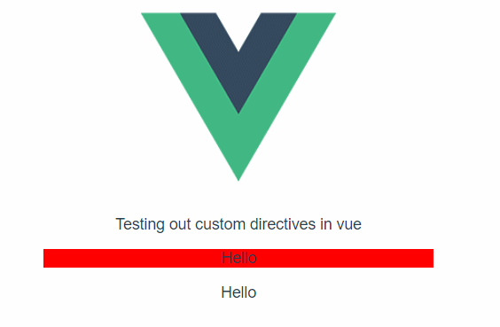

# Custom Directives example

~Highlight directive



## Directive Use
```
<p v-highlight="'red'">Hello</p>

<p v-highlight.blink="'green'">Hello</p>

<span v-highlight="'#fff'">Hello</span>
```

## Project setup
```
npm install
```

### Compiles and hot-reloads for development
```
npm run serve
```

### Compiles and minifies for production
```
npm run build
```

### Lints and fixes files
```
npm run lint
```
